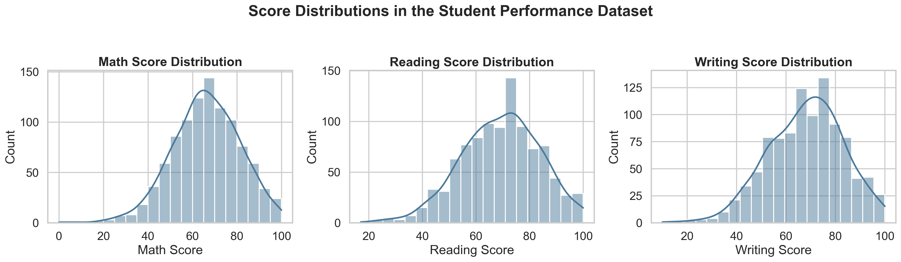
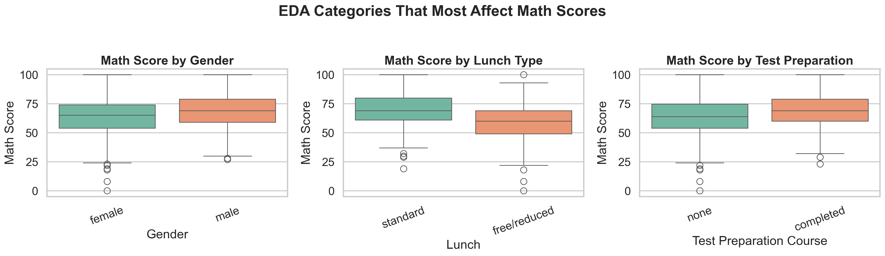
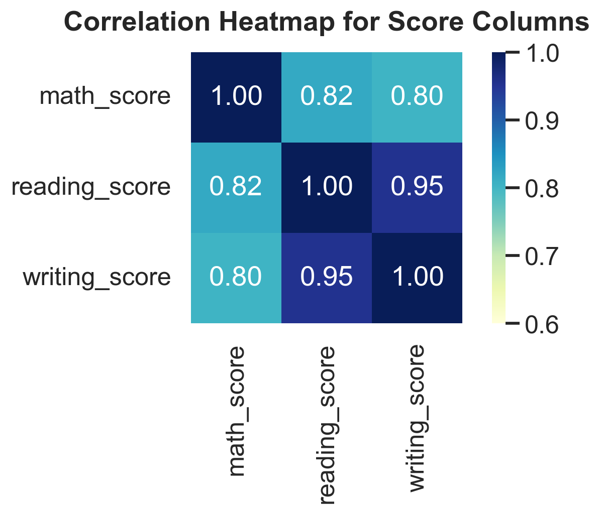
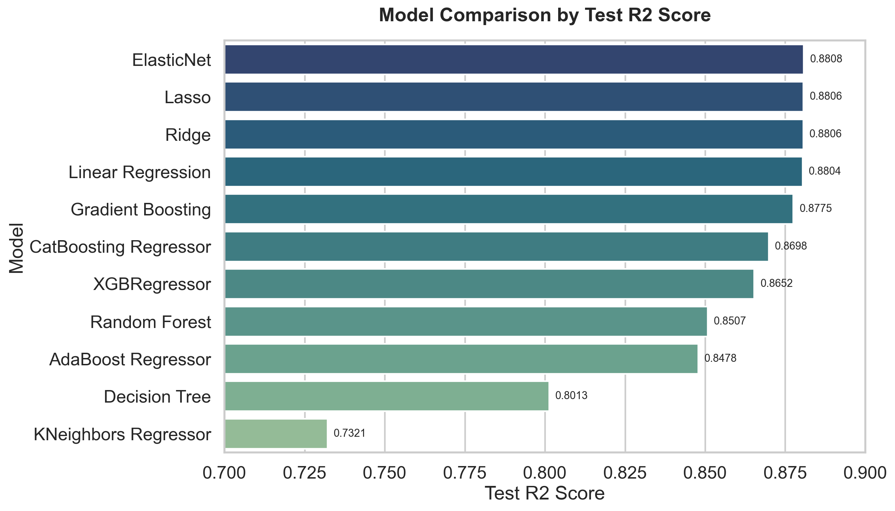
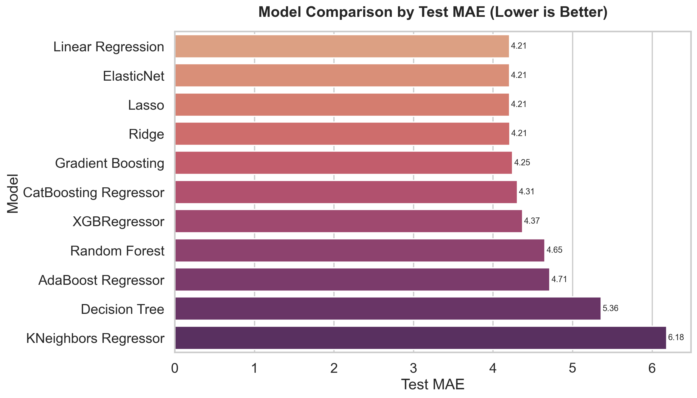
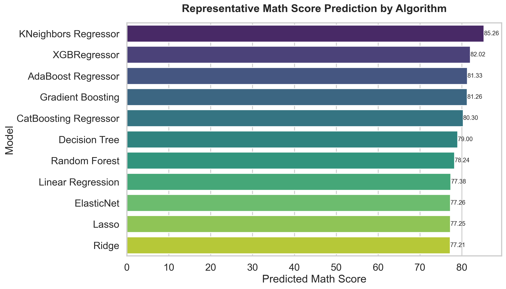

# Student Performance Indicator

End-to-end machine learning project that predicts a student's `math_score` from demographic, academic, and support-related features. The project includes exploratory data analysis, preprocessing, model benchmarking, artifact saving, and a Flask web app for live prediction.

## Project Snapshot

- Problem type: regression
- Target column: `math_score`
- Dataset size: 1000 student records
- Input features: 5 categorical + 2 numerical
- Engineered features: `language_average`, `language_total`, `language_gap`
- Best current model: `ElasticNet`
- Best test score: `R2 = 0.8808`
- Best test error: `MAE = 4.2075`

## Dataset

The project uses the Student Performance dataset from the Kaggle exam performance benchmark. The raw columns are:

- `gender`
- `race_ethnicity`
- `parental_level_of_education`
- `lunch`
- `test_preparation_course`
- `reading_score`
- `writing_score`
- `math_score`

The notebook checks showed:

- no missing values
- no duplicate rows
- balanced gender distribution
- strong linear relationships between reading, writing, and math scores

## EDA Methods Used

The exploratory analysis was done in `notebook/1 . EDA STUDENT PERFORMANCE .ipynb` using the following methods:

| Method | Purpose | What it showed |
| --- | --- | --- |
| Shape and schema checks | Confirm dataset size and columns | 1000 rows, 8 columns |
| Missing value check | Validate data quality | No missing values |
| Duplicate check | Make sure records are unique | No duplicates found |
| Data type review | Confirm numerical vs categorical columns | Data types were consistent |
| Descriptive statistics | Study mean, min, max, spread | Score ranges looked realistic |
| Univariate plots | Inspect score distributions | Scores cluster around the 60-80 range |
| Bivariate plots | Compare score behavior across categories | Lunch and test prep matter |
| Multivariate plots | Study subject relationships together | Reading and writing track math closely |
| Correlation heatmap | Quantify numeric relationships | Reading and writing are strongest signals |
| Feature engineering checks | Create extra score features | Average and gap features are useful for modeling |

## EDA Conclusions

The notebook conclusions translate directly into the final pipeline and modeling choices:

- Reading and writing scores are the strongest numeric predictors for math score.
- Students with standard lunch generally perform better than students with free or reduced lunch.
- Students who completed the test preparation course tend to score higher.
- Female students show stronger overall performance on average.
- Male students tend to score a bit better in math specifically.
- Group E tends to perform best, while Group A and Group B trend lower.
- A simple linear pattern already explains most of the signal in this dataset, which is why regularized linear models perform very well.

## EDA Graphs

These figures are generated from the dataset and included in the repo for the README.







## Data Processing

The preprocessing pipeline lives in `src/components/data_transformation.py` and does the following:

- applies EDA-driven feature engineering
- creates:
  - `language_average`
  - `language_total`
  - `language_gap`
- imputes numerical values with the median
- imputes categorical values with the most frequent category
- one-hot encodes categorical columns
- scales numerical and encoded features

This preprocessing pipeline is saved to `artifacts/preprocessor.pkl` and reused at prediction time so training and inference stay consistent.

## Model Benchmarking

The training pipeline compares several regression models using `GridSearchCV`.

| Model | Best Params | Test R2 | Test MAE | Sample Prediction |
| --- | --- | ---: | ---: | ---: |
| ElasticNet | `alpha=0.01, l1_ratio=0.9` | 0.8808 | 4.2075 | 77.26 |
| Lasso | `alpha=0.01` | 0.8806 | 4.2082 | 77.25 |
| Ridge | `alpha=1.0` | 0.8806 | 4.2106 | 77.21 |
| Linear Regression | `default` | 0.8804 | 4.2073 | 77.38 |
| Gradient Boosting | `learning_rate=0.05, max_depth=2, n_estimators=256, subsample=0.8` | 0.8775 | 4.2459 | 81.26 |
| CatBoosting Regressor | `depth=4, iterations=300, learning_rate=0.03` | 0.8698 | 4.3059 | 80.30 |
| XGBRegressor | `learning_rate=0.05, max_depth=3, n_estimators=128, subsample=0.8` | 0.8652 | 4.3711 | 82.02 |
| Random Forest | `max_depth=8, min_samples_leaf=2, n_estimators=256` | 0.8507 | 4.6526 | 78.24 |
| AdaBoost Regressor | `learning_rate=0.5, n_estimators=256` | 0.8478 | 4.7142 | 81.33 |
| Decision Tree | `criterion=absolute_error, max_depth=6, min_samples_leaf=4` | 0.8013 | 5.3575 | 79.00 |
| KNeighbors Regressor | `n_neighbors=9, p=1, weights=distance` | 0.7321 | 6.1817 | 85.26 |

Notes:

- The `Sample Prediction` column uses one representative student profile:
  - female
  - group C
  - bachelor's degree
  - standard lunch
  - completed test preparation course
  - reading score = 88
  - writing score = 90
- The sample prediction does not mean the model is more accurate. Use `Test R2` and `Test MAE` for ranking.

## Model Comparison Graphs

These graphs compare the models by accuracy and error.







## Representative Prediction Table

The raw sample predictions used in the chart are also saved in `assets/model_sample_predictions.csv`.

| Model | Prediction |
| --- | ---: |
| KNeighbors Regressor | 85.26 |
| XGBRegressor | 82.02 |
| AdaBoost Regressor | 81.33 |
| Gradient Boosting | 81.26 |
| CatBoosting Regressor | 80.30 |
| Decision Tree | 79.00 |
| Random Forest | 78.24 |
| Linear Regression | 77.38 |
| ElasticNet | 77.26 |
| Lasso | 77.25 |
| Ridge | 77.21 |

## Flask App

The web app is powered by Flask and uses these main files:

- `application.py` for the Flask routes
- `templates/index.html` for the landing page
- `templates/home.html` for the prediction form
- `src/pipeline/predict_pipeline.py` for inference

How it works:

1. The user opens the landing page.
2. The user clicks into the prediction form.
3. The form data is wrapped in `CustomData`.
4. The saved preprocessor transforms the input.
5. The saved model predicts `math_score`.
6. The result is displayed in the browser.

## Run Locally

### 1. Create a virtual environment

If you do not already have an environment, create one from the project root:

```powershell
python -m venv .venv
```

### 2. Activate the environment

On PowerShell:

```powershell
.\.venv\Scripts\Activate.ps1
```

If PowerShell blocks activation, run:

```powershell
Set-ExecutionPolicy -Scope Process RemoteSigned
.\.venv\Scripts\Activate.ps1
```

### 3. Install dependencies

```powershell
pip install -r requirements.txt
```

### 4. Start the Flask app

```powershell
python application.py
```

### 5. Open the app in your browser

```text
http://127.0.0.1:5000/
```

The prediction form is available at:

```text
http://127.0.0.1:5000/predictdata
```

## Optional Retraining

If you want to regenerate the artifacts after changing the pipeline, run:

```powershell
python src/components/data_ingestion.py
```

That will rebuild:

- `artifacts/train.csv`
- `artifacts/test.csv`
- `artifacts/preprocessor.pkl`
- `artifacts/model.pkl`
- `artifacts/model_report.json`
- `artifacts/model_summary.json`

## Project Structure

```text
mlproject/
|-- application.py
|-- app.py
|-- requirements.txt
|-- README.md
|-- artifacts/
|   |-- data.csv
|   |-- train.csv
|   |-- test.csv
|   |-- preprocessor.pkl
|   |-- model.pkl
|   |-- model_report.json
|   |-- model_summary.json
|-- assets/
|   |-- eda_score_distributions.png
|   |-- eda_category_boxplots.png
|   |-- eda_correlation_heatmap.png
|   |-- model_r2_comparison.png
|   |-- model_mae_comparison.png
|   |-- model_prediction_comparison.png
|-- notebook/
|   |-- 1 . EDA STUDENT PERFORMANCE .ipynb
|   |-- 2. MODEL TRAINING.ipynb
|   |-- data/
|       |-- stud.csv
|-- src/
|   |-- components/
|   |   |-- data_ingestion.py
|   |   |-- data_transformation.py
|   |   |-- model_trainer.py
|   |-- pipeline/
|   |   |-- predict_pipeline.py
|   |-- exception.py
|   |-- logger.py
|   |-- utils.py
|-- templates/
|   |-- index.html
|   |-- home.html
```

## Libraries Used

- Python
- Flask
- pandas
- NumPy
- scikit-learn
- XGBoost
- CatBoost
- Matplotlib
- Seaborn
- pickle
- Jupyter Notebook

## Key Takeaways

- The notebook analysis gave clear intuition about the important features.
- The pipeline now uses those insights directly through engineered features.
- Regularized linear models perform best on this dataset.
- The Flask app makes the project easy to demonstrate locally and on GitHub.
